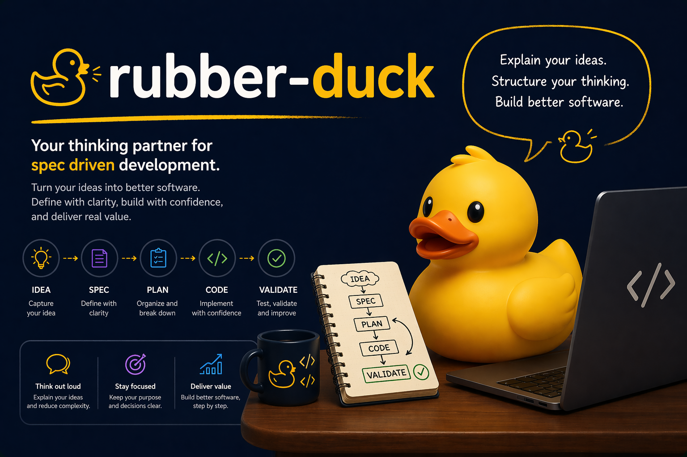

<p align="center">
  
</p>

# Rubber Duck

<p align="center">
  
  
  
  
  
</p>

Rubber Duck is a marketplace-ready plugin for Claude Code and Codex that turns fuzzy software work into crisp artifacts, reviewed plans, focused implementation, and safer commits. It is cute on the outside, stubbornly practical on the inside.

Bring it a product idea, Jira link, bug report, local diff, or GitHub PR. Rubber Duck helps ask the right questions, write the right document, call in specialist reviewers, and keep the path from idea to push small enough to reason about.

This repository is built from a clean-room plan. It does not assume or reuse any previous Rubber Duck implementation.

## Install

Rubber Duck supports installation through the plugin marketplace in both Claude Code and Codex.

### Claude Code

Add the marketplace:

```text
/plugin marketplace add vilarjp/rubber-duck
```

Install the plugin:

```text
/plugin install rubber-duck@rubber-duck
```

Start a new session or reload plugins, then invoke Rubber Duck with the plugin namespace:

```text
/rubber-duck:prd
/rubber-duck:plan
/rubber-duck:diagnosis
/rubber-duck:implement
/rubber-duck:code-review
/rubber-duck:commit-push
```

### Codex

Add the marketplace:

```text
codex plugin marketplace add vilarjp/rubber-duck
```

Open Codex and the plugin directory:

```text
codex
/plugins
```

Select the `rubber-duck` marketplace, install the `rubber-duck` plugin, then start a new thread or restart Codex if the plugin does not appear immediately.

Install the Codex reviewer agents for the current project:

```text
/rubber-duck:setup-codex-agents
```

This generates Codex custom-agent TOML files under `.codex/agents/` with `gpt-5.5` and medium reasoning. Use `/rubber-duck:setup-codex-agents --global` if you want the generated agents in `~/.codex/agents/` instead.

Invoke Rubber Duck from the plugin and skill mention UI, or ask Codex to use a Rubber Duck skill:

```text
/rubber-duck:prd
/rubber-duck:plan
/rubber-duck:diagnosis
/rubber-duck:implement
/rubber-duck:code-review
/rubber-duck:commit-push
```

## What It Does

| Moment             | Rubber Duck helps with                                                                                             |
| ------------------ | ------------------------------------------------------------------------------------------------------------------ |
| Product idea       | Turns rough prompts or Jira context into a concise PRD.                                                            |
| Technical planning | Builds an implementation plan and sends it through maintainer, security, and staff-engineer review.                |
| Bug investigation  | Produces an evidence-backed diagnosis before anyone starts changing code.                                          |
| Implementation     | Guides scoped, test-first changes against an approved artifact or direct request.                                  |
| Code review        | Reviews local diffs or PRs with specialist agents for correctness, security, tests, patterns, and plan alignment.  |
| Commit and push    | Proposes conventional commit splits, blocks protected branches, asks for explicit confirmation, and pushes safely. |

## Skill Menu

| Invoke                     | Use it when                                                         | Inputs                                                                         | Output                                                             |
| -------------------------- | ------------------------------------------------------------------- | ------------------------------------------------------------------------------ | ------------------------------------------------------------------ |
| `/rubber-duck:prd`         | You need the what and why before implementation.                    | Free-form prompt or Jira link.                                                 | `docs/yyyy-mm-dd-{slug}/prd.md` pending approval.                  |
| `/rubber-duck:plan`        | You need the technical how for a feature, bug fix, or approved PRD. | Prompt, Jira link, or PRD slug.                                                | `docs/yyyy-mm-dd-{slug}/plan.md` pending approval.                 |
| `/rubber-duck:diagnosis`   | You need to understand a bug before fixing it.                      | Bug report, Jira link, logs, reproduction notes, or source hint.               | `docs/yyyy-mm-dd-{slug}/diagnosis.md` pending approval.            |
| `/rubber-duck:implement`   | You are ready to make a scoped code change.                         | Implementation prompt, Jira link, or approved plan/diagnosis/code-review slug. | Code and tests changed in the target project.                      |
| `/rubber-duck:code-review` | You want a structured review of a local diff or GitHub PR.          | Empty input for local changes, GitHub PR link, or plan/source hint.            | `docs/yyyy-mm-dd-{slug}/code-review.md` pending approval.          |
| `/rubber-duck:commit-push` | You want to ship local work deliberately.                           | Optional branch or commit-intent hint.                                         | One or more conventional commits pushed to a non-protected branch. |
| `/rubber-duck:setup-codex-agents` | You installed Rubber Duck in Codex and want reviewer agents available. | Optional `--global`, `--project`, `--model`, or `--reasoning` flags.           | Generated Codex custom agents in `.codex/agents/` or `~/.codex/agents/`. |

## Review Crew

| Agent                          | Used by                                   | Checks                                                                                                 |
| ------------------------------ | ----------------------------------------- | ------------------------------------------------------------------------------------------------------ |
| `document-reviewer`            | `prd`, `plan`, `diagnosis`, `code-review` | Document completeness, correctness, missing questions, and approval readiness.                         |
| `plan-future-maintainer`       | `plan`                                    | Whether a future maintainer can understand intent, constraints, decisions, and rollback context.       |
| `plan-security-reviewer`       | `plan`                                    | LGPD, PII, PCI, authorization, validation, secrets, logging, retention, and abuse-case gaps.           |
| `plan-staff-engineer`          | `plan`                                    | Architecture risk, stack fit, production bugs, compatibility, observability, and simpler options.      |
| `code-staff-engineer-reviewer` | `code-review`                             | Correctness, maintainability, stack best practices, production risk, and required fixes.               |
| `project-patterns-reviewer`    | `code-review`                             | Local conventions, naming, layering, testing style, file organization, and companion docs.             |
| `implementation-plan-matcher`  | `code-review`                             | Whether the implementation matches the approved plan without missing work or extra scope.              |
| `code-security-reviewer`       | `code-review`                             | Security, privacy, compliance, authorization, validation, secrets, dependency risk, and data exposure. |
| `test-reviewer`                | `code-review`                             | Meaningful coverage, edge cases, weak assertions, redundant tests, and recommended focused tests.      |

Reviewer agents return findings and exact human questions to the invoking skill. Claude Code installs the Markdown agents from `plugins/rubber-duck/agents/`, where they are pinned to Sonnet. Codex uses `/rubber-duck:setup-codex-agents` to generate equivalent TOML custom agents with `gpt-5.5` and medium reasoning. Skills must invoke these reviewers by exact pre-built agent name, omit full-history forks for Codex named agents, and use the launch prompt only for run-specific context such as document paths, diffs, source summaries, and verification results. They should not create generic runtime subagents with compressed prompts that replace the full agent definition. The invoking skill owns document edits, merges accepted findings, and asks the human for clarification when needed. For `plan` and `code-review`, `document-reviewer` runs last on the merged document as the approval-readiness check.

## Duck Trail

```text
/rubber-duck:prd -> /rubber-duck:plan -> /rubber-duck:implement -> /rubber-duck:code-review -> /rubber-duck:commit-push
/rubber-duck:diagnosis -> /rubber-duck:implement -> /rubber-duck:code-review -> /rubber-duck:commit-push
GitHub PR link -> /rubber-duck:code-review
```

Generated PRD, plan, diagnosis, and code-review documents live in the target project under:

```text
docs/yyyy-mm-dd-{slug}/
```

Documents start as `pending-approval` in YAML frontmatter. Human confirmation updates them to `approved` or `requested-changes` with a decision date and short note.

Approval is intentionally a loop. Rubber Duck should ask follow-up questions as many times as necessary until approval-relevant ambiguity is resolved, explicitly deferred by the human as non-blocking, or the workflow stops. Generated documents separate `Blocking Questions` from `Deferred Non-Blocking Questions` so unresolved approval blockers do not get hidden in ordinary notes.

## Safety Rails

- `implement` follows TDD whenever feasible and explains when it cannot.
- `implement` runs a full quality gate before completion: format checks, linting, type checks, builds, and the full automated test suite when those commands exist.
- `commit-push` runs the same final verification gate before commit and push confirmation, and stops when required checks fail or cannot run without explicit human risk acceptance.
- `commit-push` refuses `main`, `master`, `production`, and `staging`.
- `commit-push` requires the exact final confirmation: `yes, commit and push`.
- Skills keep work scoped and avoid unrelated refactors.
- Jira links rely only on authenticated tools already available in the user's current assistant session.
- Reviewer agents return findings and questions to the invoking skill instead of writing separate review files.

## Troubleshooting

If marketplace installation fails in a slash-command plugin host, confirm the repository is reachable and that `.claude-plugin/marketplace.json` points to `plugins/rubber-duck`.

If marketplace installation fails in a plugin UI host, confirm the repository is reachable, `.agents/plugins/marketplace.json` points to `./plugins/rubber-duck`, and `plugins/rubber-duck/.codex-plugin/plugin.json` exists.

## Contributing And Releases

Rubber Duck is versioned with SemVer in both plugin manifests:

- `plugins/rubber-duck/.claude-plugin/plugin.json`
- `plugins/rubber-duck/.codex-plugin/plugin.json`

Keep both manifest versions in sync. Release tags use the `vX.Y.Z` form, starting with `v0.0.1`.
