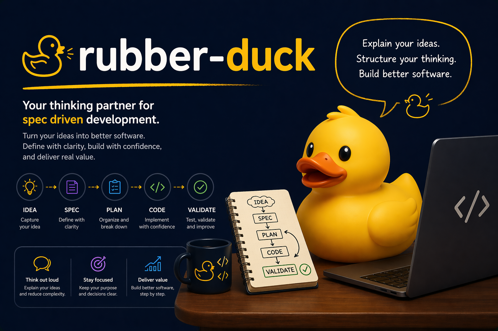

<p align="center">
  
</p>

# Rubber Duck

<p align="center">
  
  
  
  
  
</p>

Rubber Duck is a marketplace-ready plugin for Claude Code and Codex that turns fuzzy software work into crisp artifacts, reviewed plans, focused implementation, and safer commits. It is cute on the outside, stubbornly practical on the inside.

Bring it a product idea, Jira link, bug report, local diff, or GitHub PR. Rubber Duck helps ask the right questions, write the right document, call in specialist reviewers, and keep the path from idea to push small enough to reason about.

This repository is built from a clean-room plan. It does not assume or reuse any previous Rubber Duck implementation.

## Install

Rubber Duck supports installation through the plugin marketplace in both Claude Code and Codex.

### Claude Code

Add the marketplace:

```text
/plugin marketplace add vilarjp/rubber-duck
```

Install the plugin:

```text
/plugin install rubber-duck@rubber-duck
```

Start a new session or reload plugins, then invoke Rubber Duck with the plugin namespace:

```text
/rubber-duck:prd
/rubber-duck:plan
/rubber-duck:diagnosis
/rubber-duck:orchestrate-implementation
/rubber-duck:implement
/rubber-duck:frontend-design
/rubber-duck:code-review
/rubber-duck:commit-push
```

### Codex

Add the marketplace:

```text
codex plugin marketplace add vilarjp/rubber-duck
```

Open Codex and the plugin directory:

```text
codex
/plugins
```

Select the `rubber-duck` marketplace, install the `rubber-duck` plugin, then start a new thread or restart Codex if the plugin does not appear immediately.

Install the Codex custom agents for the current project:

```text
/rubber-duck:setup-codex-agents
```

This generates 62 Codex custom-agent TOML files under the nearest project root's `.codex/agents/` with `gpt-5.5`, medium reasoning, and each Rubber Duck agent's declared sandbox. Use `/rubber-duck:setup-codex-agents --global` if you want the generated agents in `~/.codex/agents/` instead. Re-run setup after upgrading Rubber Duck so existing Codex projects regenerate the current agent inventory.

Upgrade note for `0.4.1`: live plugin metadata no longer advertises the retired eval workflow, setup and validation share the same agent parsing/rendering contract, `source-agents` can be synchronized mechanically, and prompt contracts now preserve reviewer questions and severity/confidence discipline more consistently.

Upgrade note for `0.4.0`: setup now refuses to write through symlinked agents directories, symlinked Rubber Duck target TOML files, or non-file Rubber Duck target destinations, and it prunes stale Rubber Duck generated TOML files that carry the Rubber Duck generated header. Unrelated custom TOML files, including symlinked dotfiles-managed agents, are preserved.

Workflow note for `0.4.0`: medium or complex PRDs and plans may run plan-time council voices before formal review. Non-pass council positions are approval blockers until the document is adjusted, the reviewer concedes, or the human explicitly records a non-blocking deferral.

Invoke Rubber Duck from the plugin and skill mention UI, or ask Codex to use a Rubber Duck skill:

```text
/rubber-duck:prd
/rubber-duck:plan
/rubber-duck:diagnosis
/rubber-duck:orchestrate-implementation
/rubber-duck:implement
/rubber-duck:frontend-design
/rubber-duck:code-review
/rubber-duck:commit-push
```

## What It Does

| Moment             | Rubber Duck helps with                                                                                             |
| ------------------ | ------------------------------------------------------------------------------------------------------------------ |
| Product idea       | Turns rough prompts or Jira context into a concise PRD.                                                            |
| Technical planning | Builds a contract-first, where-aware implementation plan with ownership surfaces, execution strategy, small subtasks, and maintainer/security/staff review. |
| Bug investigation  | Produces an evidence-backed diagnosis before anyone starts changing code.                                          |
| Orchestration      | Coordinates approved plan subtasks sequentially or with parallel-safe `implementation-agent` and `test-implementer` workers. |
| Implementation     | Guides scoped, test-first changes against an approved artifact or direct request, including planned task progress and bounded agent delegation. |
| Frontend design    | Creates or renovates polished, responsive, accessible frontend experiences with UX/UI, accessibility, and UX-writing specialist review when useful. |
| Code review        | Reviews local diffs or PRs with specialist agents for correctness, security, tests, patterns, and plan alignment.  |
| Commit and push    | Organizes related-change commits, checks shipping hygiene, blocks protected branches, asks for explicit confirmation, and pushes safely. |

## Skill Menu

| Invoke                                    | Use it when                                                            | Inputs                                                                             | Output                                                                                       |
| ----------------------------------------- | ---------------------------------------------------------------------- | ---------------------------------------------------------------------------------- | -------------------------------------------------------------------------------------------- |
| `/rubber-duck:prd`                        | You need the what and why before implementation.                       | Free-form prompt or Jira link.                                                     | `docs/yyyy-mm-dd-{slug}/prd.md` pending approval.                                            |
| `/rubber-duck:plan`                       | You need the technical where and how for a feature, bug fix, or approved PRD. | Prompt, Jira link, or PRD slug.                                                    | `docs/yyyy-mm-dd-{slug}/plan.md` pending approval, with `Implementation Surface` and subtasks for medium-to-complex work. |
| `/rubber-duck:diagnosis`                  | You need to understand a bug before fixing it.                         | Bug report, Jira link, logs, reproduction notes, or source hint.                   | `docs/yyyy-mm-dd-{slug}/diagnosis.md` pending approval.                                      |
| `/rubber-duck:orchestrate-implementation` | You need to coordinate an approved plan's subtasks.                    | Approved plan slug/path, optional task IDs, and optional sequential/parallel hint. | Code/tests changed; completed planned subtasks emit `task_N.md` progress docs.               |
| `/rubber-duck:implement`                  | You are ready to make a scoped code change.                            | Implementation prompt, Jira link, or approved plan/diagnosis/code-review slug.     | Code/tests changed; planned subtasks emit `task_N.md` progress docs.                         |
| `/rubber-duck:frontend-design`            | You need a greenfield UI or existing frontend renovation.              | Product brief, target route/path, screenshot context, or redesign request.         | Working frontend code with design-system, responsive, accessibility, and polish guidance.     |
| `/rubber-duck:code-review`                | You want a structured review of a local diff or GitHub PR.             | Empty input for local changes, GitHub PR link, or plan/source hint.                | `docs/yyyy-mm-dd-{slug}/code-review.md` pending approval.                                    |
| `/rubber-duck:commit-push`                | You want to ship local work deliberately.                              | Optional branch or commit-intent hint.                                             | One or more conventional commits pushed to a non-protected branch.                           |
| `/rubber-duck:setup-codex-agents`         | You installed or upgraded Rubber Duck in Codex and want custom agents available. | Optional `--global`, `--project`, `--agents-dir`, `--model`, `--reasoning`, or `--dry-run` flags. | 62 generated Codex custom agents in `.codex/agents/`, `~/.codex/agents/`, or a custom agents directory. |

## Agent Orchestration Model

Rubber Duck skills are the orchestrators. They gather source context, choose scope, ask the human focused questions, edit final artifacts, and run verification. Agents are named specialists that return evidence, critique, candidate questions, or bounded implementation changes inside an assigned scope.

Every workflow skill declares at least one specialist agent crew.

Skills invoke exact pre-built agent names when those agents exist. Claude Code installs Markdown agents from `plugins/rubber-duck/agents/`, where they are pinned to Sonnet. Codex uses `/rubber-duck:setup-codex-agents` to generate equivalent TOML custom agents with `gpt-5.5` and medium reasoning. Launch prompts should provide only run-specific context such as document paths, diffs, source summaries, assigned tasks, ownership boundaries, and verification results; they should not replace the full agent definition with a compressed generic role prompt.

Agent usage scales by complexity: simple work stays local or uses one narrow specialist, medium work uses research or review agents when risk warrants it, and complex work uses explicit fan-out/fan-in across independent questions or disjoint write sets. Plans define contracts or stable existing interfaces before assigning parallel implementation. After parallel workers return, the invoking skill acts as integration coordinator and reconciles contract assumptions, generated artifacts, task documents, and verification before dependent work starts. Read-only agents inspect and advise. Workspace-write agents are limited to `implementation-agent` and `test-implementer`; they require explicit ownership boundaries and are inspected by the invoking skill before completion.

## Research And Implementation Crew

| Agent                     | Used by                                                                 | Helps with                                                                                          |
| ------------------------- | ----------------------------------------------------------------------- | --------------------------------------------------------------------------------------------------- |
| `codebase-locator`        | `plan`, `diagnosis`, `implement`, `frontend-design`, `code-review`      | Finds relevant source, tests, config, docs, generated files, routes, and entry points.               |
| `codebase-analyzer`       | `plan`, `diagnosis`, `implement`, `frontend-design`, `code-review`      | Explains current behavior, data flow, dependencies, tests, side effects, and uncertainty.            |
| `codebase-pattern-finder` | `plan`, `diagnosis`, `implement`, `frontend-design`, `code-review`      | Finds nearby implementation, frontend, workflow, and test patterns to reuse or avoid.                |
| `codebase-researcher`     | `plan`, `diagnosis`, `implement`, `orchestrate-implementation`, `frontend-design`, `code-review` | Coordinates locator, analyzer, pattern, and docs findings into an evidence-backed research brief.    |
| `docs-locator`            | `prd`, `plan`, `diagnosis`, `implement`, `frontend-design`, `code-review` | Finds generated Rubber Duck artifacts, task docs, ADRs, standards, README notes, and project docs.   |
| `docs-analyzer`           | `prd`, `plan`, `diagnosis`, `implement`, `orchestrate-implementation`, `frontend-design`, `code-review` | Extracts decisions, requirements, constraints, stale context, risks, and candidate questions.        |
| `implementation-agent`    | `implement`, `orchestrate-implementation`                               | Implements bounded production-code subtasks inside explicit write ownership and no-touch boundaries. |
| `test-plan-architect`     | `plan`, `orchestrate-implementation`                                    | Designs layered test plans with stable `T###` IDs, fixtures, commands, and manual checks.            |
| `test-implementer`        | `implement`, `orchestrate-implementation`                               | Adds or adjusts bounded test coverage inside explicit test, fixture, helper, and task-doc boundaries. |
| `learnings-researcher`    | `plan`, `diagnosis`                                                     | Searches prior `docs/`, plans, diagnoses, and reviews for applicable lessons before drafting.        |
| `web-researcher`          | `plan`, `diagnosis`, `code-review`                                      | Bounded external research via WebSearch/WebFetch when current third-party behavior shapes the work.  |
| `pattern-recognition-specialist` | `plan`                                                          | Repo-wide design patterns, anti-patterns, duplication, naming drift, and boundary smells.            |
| `spec-flow-analyzer`      | `plan`                                                                  | Continuity across PRD, plan, task progress, and code-review artifacts; missing acceptance-criteria mapping. |

## Plan-Time Council

The plan-time council is a set of debate voices invoked before the formal technical review pass on medium or complex plans, with targeted council voices used for PRDs and diagnoses when their specific lens applies. Council voices steel-man the proposal, attack its strongest form, and concede when the proposal already addresses the concern. They debate; they do not finalize plans.

| Agent                       | Used by                  | Brings                                                                                              |
| --------------------------- | ------------------------ | --------------------------------------------------------------------------------------------------- |
| `plan-thinker`              | `prd`, `plan`, `diagnosis` | Cross-domain analogy reframer. Tests whether the team is solving the right problem class.          |
| `plan-devils-advocate`      | `plan`, `diagnosis`        | Failure-mode stress tester. Steel-mans, then attacks the strongest form with concrete fixes.        |
| `plan-pragmatic-engineer`   | `plan`, `diagnosis`        | Maintenance and delivery-cost reality check. Distinguishes intentional debt from accidental complexity. |
| `plan-architect-advisor`    | `plan`                     | Long-term coupling and boundaries voice. Surfaces hidden dependencies and reversibility concerns.   |
| `plan-product-mind`         | `prd`, `plan`, `diagnosis` | User-impact and hypothesis voice. Frames decisions as "what is the hypothesis and how will we know?". |
| `plan-security-advocate`    | `plan`                    | Threat-model debate voice. Assumes breach and pushes containment design upstream of the security audit. |

## Specialist Review And Hygiene Crew

| Agent                          | Used by                                   | Checks                                                                                                               |
| ------------------------------ | ----------------------------------------- | -------------------------------------------------------------------------------------------------------------------- |
| `document-reviewer`            | `prd`, `plan`, `diagnosis`, `code-review` | Routes to the matching type-specific document reviewer (and optional coherence pass) and merges findings.            |
| `document-coherence-reviewer`  | `prd`, `plan`, `diagnosis`, `code-review` | Internal contradictions, terminology drift, broken cross-references, and ambiguity inside one document.              |
| `prd-document-reviewer`        | `prd`                                     | PRD structure, goals, non-goals, acceptance criteria, risks, dependencies, and approval readiness.                   |
| `plan-document-reviewer`       | `plan`                                    | Plan structure, implementation surface, subtasks, verification, rollout, rollback, and approval readiness.            |
| `diagnosis-document-reviewer`  | `diagnosis`                               | Diagnosis evidence quality, hypothesis ranking, root-cause confidence, reproduction, and recommended next steps.     |
| `code-review-document-reviewer` | `code-review`                            | Code-review document severity ordering, changed-line evidence, plan alignment, test/security notes, approval clarity. |
| `task-progress-document-reviewer` | via `document-reviewer` for `task_N.md` docs | Handoff quality, completed scope, deviations, verification, blockers, next-task recommendation.    |
| `prd-product-reviewer`         | `prd`                                     | PRD-specific product audit: scope control, acceptance criteria, risks, dependencies, downstream plannability. Complements `plan-product-mind` (council debate). |
| `diagnosis-root-cause-investigator` | `diagnosis`                          | Evidence quality, root-cause confidence, affected flows, competing hypotheses, and next-step recommendations.        |
| `frontend-ux-ui-reviewer`      | `frontend-design`                         | Information architecture, interaction quality, visual hierarchy, responsive layout, usability, and design-system fit. |
| `frontend-accessibility-reviewer` | `frontend-design`                      | Semantic structure, keyboard behavior, focus management, contrast, reduced motion, touch targets, and inclusive states. |
| `frontend-ux-writing-reviewer` | `frontend-design`                         | Labels, calls to action, errors, empty/loading/success states, terminology, localization, and content resilience.    |
| `plan-future-maintainer`       | `plan`                                    | Whether a future maintainer can understand intent, constraints, decisions, and rollback context.                     |
| `plan-security-reviewer`       | `plan`                                    | Coordinates plan compliance, data-handling, authz, and supply-chain specialists; retains input-validation/output-encoding/abuse-case review. |
| `plan-staff-engineer`          | `plan`                                    | Lead reviewer for stack fit, framework idioms, simpler-implementation alternatives, compatibility; delegates design/observability/execution-strategy. |
| `plan-compliance-reviewer`     | `plan`                                    | LGPD, PII classification, PCI scope, and regulatory obligations triggered by the plan.                              |
| `plan-data-handling-reviewer`  | `plan`                                    | Storage, retention, deletion, backups, residency, exports, and third-party sharing implications.                    |
| `plan-authz-reviewer`          | `plan`                                    | Authentication, authorization, ownership, tenant isolation, IDOR, and permission model design.                       |
| `plan-supply-chain-reviewer`   | `plan`                                    | Dependency, package, build, webhook, integration, generated-code, and vendor trust-boundary risk.                   |
| `plan-design-reviewer`         | `plan`                                    | Architecture choices, proportional design, migration/compatibility, public contracts, and abstraction level.         |
| `plan-observability-reviewer`  | `plan`                                    | Metrics, logs, traces, alerts, diagnosability, and SLI/SLO implications in the plan.                                |
| `plan-execution-strategy-reviewer` | `plan`, `orchestrate-implementation`  | Subtask sequence, parallelization safety, ownership boundaries, merge risk, and progress-document shape.            |
| `code-staff-engineer-reviewer` | `code-review`                             | Lead reviewer: stack fit, framework idioms, simpler-implementation alternatives; delegates correctness/maintainability/production-risk lanes. |
| `code-correctness-reviewer`    | `code-review`                             | Logic errors, edge cases, state transitions, error propagation, intent-vs-implementation mismatches.                  |
| `code-maintainability-reviewer` | `code-review`                            | Simplicity, naming, dead code, premature abstraction, indirection, coupling, readability.                            |
| `code-production-risk-reviewer` | `code-review`                            | Concurrency, idempotency, ordering, performance hotspots, observability, rollout risk.                                |
| `project-patterns-reviewer`    | `code-review`                             | Local conventions, naming, layering, testing style, file organization, and companion docs.                           |
| `implementation-plan-matcher`  | `code-review`                             | Whether the implementation matches the approved plan, subtasks, task docs, and scope.                                |
| `code-security-reviewer`       | `code-review`                             | Coordinates code-* security specialists (secrets, input validation, authz, abuse cases, data exposure).              |
| `code-secrets-reviewer`        | `code-review`                             | Hardcoded credentials, tokens, leak-prone logs, sensitive config exposure.                                          |
| `code-input-validation-reviewer` | `code-review`                           | Parsing, validation, sanitization, escaping, bounds checks, injection surfaces.                                     |
| `code-authz-reviewer`          | `code-review`                             | Authentication, authorization, ownership, tenant boundaries, IDOR, permission gates.                                |
| `code-abuse-case-reviewer`     | `code-review`                             | Rate limits, replay, idempotency, webhook trust, spam/fraud, oversized inputs, automation abuse.                    |
| `code-data-exposure-reviewer`  | `code-review`                             | PII, customer content, sensitive logs/analytics/errors, retention, deletion, exports, third-party sharing.          |
| `test-reviewer`                | `code-review`                             | Meaningful coverage, edge cases, weak assertions, redundant tests, and recommended focused tests.                    |
| `commit-organization-reviewer` | `commit-push`                             | Related-change commit grouping, split/fold concerns, excluded work, commit dependencies, and conventional messages. |
| `shipping-hygiene-reviewer`    | `commit-push`                             | Commit scope, secrets, debug artifacts, unrelated files, verification notes, and shipping readiness.                 |
| `agent-packaging-reviewer`     | `setup-codex-agents`                      | Root/source mirror consistency, sandbox declarations, generated TOML behavior, setup scripts, and validation risks.  |
| `agent-prompt-reviewer`        | `setup-codex-agents` (conditional)        | Rubber Duck agent and skill prompt quality: scope clarity, confidence anchors, severity tiers, output schema discipline. |
| `agent-runtime-parity-reviewer` | `setup-codex-agents`                     | Cross-runtime parity: mirror drift, generated TOML behavior, sandbox parity, model/reasoning defaults, fallback declarations. |
| `api-contract-reviewer`        | `code-review`, `plan` (conditional)       | Public API/CLI/plugin/event/webhook contract changes; backward compatibility, deprecation discipline, consumer impact. |
| `data-migrations-reviewer`     | `code-review`, `plan` (conditional)       | Data shape migrations, storage format changes, destructive transforms, backfills, retention/deletion, rollback safety.  |
| `design-implementation-validator` | `frontend-design` (conditional)        | Frontend implementation parity vs UX intent, design tokens, responsive states, visual states, accessibility constraints. |

Specialist agents return findings, evidence, and exact questions to the invoking skill. The invoking skill classifies which questions need the human, owns document edits, merges accepted findings, handles conflicts, and asks for clarification when needed. For approval-gated documents, `document-reviewer` runs last on the merged document as the approval-readiness check.

## Duck Trail

```text
/rubber-duck:prd -> /rubber-duck:plan -> /rubber-duck:orchestrate-implementation -> /rubber-duck:code-review -> /rubber-duck:commit-push
/rubber-duck:diagnosis -> /rubber-duck:plan -> /rubber-duck:orchestrate-implementation -> /rubber-duck:code-review -> /rubber-duck:commit-push
/rubber-duck:implement -> /rubber-duck:code-review -> /rubber-duck:commit-push
GitHub PR link -> /rubber-duck:code-review
```

Generated PRD, plan, diagnosis, code-review, and planned-task progress documents live in the target project under:

```text
docs/yyyy-mm-dd-{slug}/
```

Approval-gated documents start as `pending-approval` in YAML frontmatter and include both `created` and `updated` dates. Human confirmation updates them to `approved` or `requested-changes` with a decision date, short note, updated date, and changelog entry. Planned-task progress documents use `type: implementation-task` and record completion status for their specific subtask.

Approval is intentionally a loop. Rubber Duck should ask follow-up questions as many times as necessary until approval-relevant ambiguity is resolved, explicitly deferred by the human as non-blocking, or the workflow stops. Generated documents separate `Blocking Questions` from `Deferred Non-Blocking Questions` so unresolved approval blockers do not get hidden in ordinary notes. When the human answers a blocking question, the original question stays in the document as an answered entry with the human answer, answer date, and document impact.

Clarifying questions are intentionally narrow. Rubber Duck investigates local code, docs, tests, and generated artifacts first, then asks 1-2 focused questions when the answer would materially change scope, architecture, behavior, data handling, security, rollout, ownership, or approval. Agents surface candidate questions with blocking/non-blocking classification; the invoking skill decides what to ask and records the answer.

Material document updates are tracked in `Document Changelog`, including human answers, requested changes, reviewer-driven updates, approvals, and requested-changes decisions.

Plans include `Contract / Interface Definition` and `Implementation Surface` before execution strategy so the document says which contract is stable and where work may happen before it says how to do the work. The surface separates write targets, read-only context, tests and verification surfaces, generated artifacts, no-touch boundaries, and parallel or merge-risk notes. Implementation and orchestration skills pass those boundaries to read-only agents as context and to workspace-write agents as explicit ownership.

Medium-to-complex plans include `Implementation Strategy` and `Implementation Subtasks`. Subtasks are expected to be small, concrete, completion-oriented units with a consumed or produced contract/interface, bounded write set, read-only context, dependencies, focused acceptance checks, and `task_N.md` output. The strategy recommends `single focused pass`, `incremental task-by-task`, or parallel `implementation-agent` / `test-implementer` delegation, and records whether `/rubber-duck:orchestrate-implementation` should coordinate the run or a simple `/rubber-duck:implement` pass is enough. Parallel groups include an integration checkpoint so contract drift, generated artifacts, task documents, and verification are reconciled before dependent work starts. Completed planned subtasks create colocated progress documents such as:

```text
docs/yyyy-mm-dd-{slug}/task_1.md
docs/yyyy-mm-dd-{slug}/task_2.md
```

Rubber Duck uses the existing complexity labels `simple`, `medium`, and `complex` to scale ceremony. Simple plans stay single-pass when possible, medium plans include explicit subtasks, and complex plans add stronger sequencing, rollout, rollback, security, and decision context. Plans created from PRDs include a stricter PRD-to-plan alignment check so goals, acceptance criteria, non-goals, risks, dependencies, and answered blocking questions survive translation into implementation work.

Shared workflow references live in `plugins/rubber-duck/skills/_shared/`. They cover clarifying questions, complexity levels, project rules discovery, source-driven external API checks, no-workaround guidance, PRD-to-plan alignment, artifact quality gates, and optional mini-ADR-style decision notes for complex plans.

## Safety Rails

- `implement` follows TDD whenever feasible and explains when it cannot.
- Skills discover repository-local rules and conventions before relying on generic preferences.
- Skills can use read-only codebase and docs agents to investigate first, then ask focused human questions for unresolved uncertainty.
- Skills minimize and redact connector, Jira, PR, log, screenshot, and user-provided content before persisting it or passing it to agents, and ask before using material from a different repository, project, customer, or workspace.
- Skills verify external framework, library, service, or API behavior from repository evidence, local package/source docs, official docs, or version-specific references when that behavior shapes a plan, implementation, diagnosis, or review.
- Skills prefer root-cause fixes and flag workaround smells such as type suppression, lint/test bypasses, swallowed errors, arbitrary sleeps, monkey patches, scattered special cases, and copy-pasted fixes.
- `orchestrate-implementation` owns multi-subtask coordination and only runs parallel workers when tasks are explicitly parallel-safe.
- `orchestrate-implementation` acts as integration coordinator after parallel work, stopping dependent work when contract/interface drift needs one explicit adjustment owner.
- `implement` reads planned subtasks and existing `task_N.md` documents before choosing the next task.
- `implement` and `orchestrate-implementation` may use `implementation-agent` only for bounded production-code work with explicit write ownership, read-only context, no-touch boundaries, dependencies, expected tests, and progress-document expectations.
- `implement` and `orchestrate-implementation` may use `test-implementer` only for bounded test work with explicit write ownership.
- `frontend-design` can fan out to UX/UI, accessibility, and UX-writing specialists for substantial work, then merges their read-only findings before final polish.
- `implement` runs a full quality gate before completion: format checks, linting, type checks, builds, and the full automated test suite when those commands exist.
- `implement` writes one progress document per completed planned subtask so later runs can see what is done and what should run next.
- `implement` and `orchestrate-implementation` may record `partial` or `blocked` task progress when delegated or sequential work cannot safely complete yet.
- `commit-push` runs `commit-organization-reviewer` for related-change grouping when the change set is multi-part or the split is uncertain.
- `commit-push` runs `shipping-hygiene-reviewer` before proposing final commits and confirmation.
- `commit-push` runs the same final verification gate before commit and push confirmation, and stops when required checks fail or cannot run without explicit human risk acceptance.
- `commit-push` refuses `main`, `master`, `production`, and `staging`.
- `commit-push` requires the exact final confirmation: `yes, commit and push`.
- `setup-codex-agents` can use `agent-packaging-reviewer` when validating mirror consistency, sandbox declarations, generated TOML behavior, and release risk; it also uses `agent-runtime-parity-reviewer` when generated TOML behavior, sandbox parity, model/reasoning defaults, or tool fallback behavior changes.
- Skills keep work scoped and avoid unrelated refactors.
- Jira links rely only on authenticated tools already available in the user's current assistant session.
- Reviewer agents return findings and questions to the invoking skill instead of writing separate review files.

## Troubleshooting

If marketplace installation fails in a slash-command plugin host, confirm the repository is reachable and that `.claude-plugin/marketplace.json` points to `plugins/rubber-duck`.

If marketplace installation fails in a plugin UI host, confirm the repository is reachable, `.agents/plugins/marketplace.json` points to `./plugins/rubber-duck`, and `plugins/rubber-duck/.codex-plugin/plugin.json` exists.

## Contributing And Releases

Rubber Duck is versioned with SemVer in both plugin manifests:

- `plugins/rubber-duck/.claude-plugin/plugin.json`
- `plugins/rubber-duck/.codex-plugin/plugin.json`

Keep both manifest versions in sync. Release tags use the `vX.Y.Z` form, starting with `v0.0.1`.

Before release, run the bundled plugin validator and installer dry-run:

```text
node plugins/rubber-duck/skills/setup-codex-agents/scripts/validate-rubber-duck-plugin.mjs
node plugins/rubber-duck/skills/setup-codex-agents/scripts/install-codex-agents.mjs --dry-run
```

The validator checks marketplace and plugin manifests, skill metadata, root/source agent mirroring, the exact expected 62 root/source/generated agents, required agent frontmatter, generated Codex defaults, and sandbox policy. Generated Codex agents should default to `gpt-5.5` with medium reasoning. Only `implementation-agent` and `test-implementer` are expected to use `workspace-write`; other agents are read-only unless a future approved plan changes the policy and validator together.
